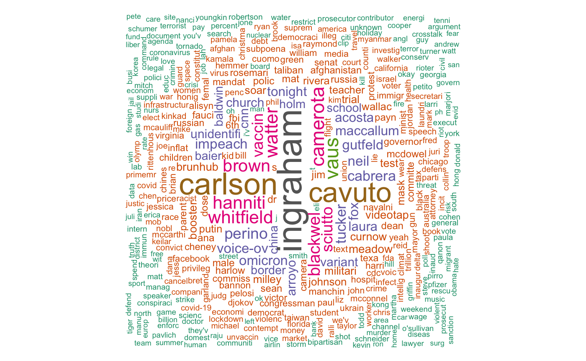

# January 6th Capitol Attack Text Analysis

## Project Overview

This repository is dedicated to text analysis tasks that delve into the coverage of the January 6th attack on the United States Capitol. It encompasses a comprehensive corpus, `cnn_fox_corpus.rdata`, which contains transcripts along with their metadata from news segments aired on CNN and Fox News from January 7, 2021, to January 7, 2022. These segments specifically include mentions of "January 6" and "Capitol." The analyses conducted here leverage techniques such as tokenization, document feature matrices, co-occurrences, Zipf's law examination, and cosine similarity measures to draw parallels between the content on Wikipedia and the narratives presented in the news transcripts.

## Key Findings
Our analyses have yielded a variety of insights, encapsulated notably in the word cloud derived from the Document Feature Matrix (DFM) with TF-IDF weighting. This visual representation underscores the prevalence of specific terms within the corpus of news scripts, highlighting the most frequently discussed names and topics within the context of the January 6th event.

